# Filther User Manual v0.1

## About Filther
Before you lies the manual to my latest experiment: _Filther_. While its interface can admittedly look daunting at first, you'd be surprised at the flexibility at your fingertips. So, to try and convince you that the effort of getting into this baby is worth it (despite its somewhat high CPU cost), here's a rundown of what it can offer:

- A flexible spline-based waveshaper. This spline can be dragged via fully automate-able nodes.
- Three other waveshaping algorithms (tanh, fast tanh, sine).
- Two filter modules, which can be automated by either dynamics or LFO.
- 80 filters to choose from. These range from clean to very dirty and mean. They include linear State Variable Filters, non-linear filters which saturate, analog filter models, frequency modulation filters, amplitude modulation filters, distortions, wah pedals, basic reverbs as well as various creative filters.
- FIR and IIR up- and downsampling (to prevent aliasing when distorting).
- Sample accurate cutoff and resonance interpolation.
- Optional inertia which can be used when live tweaking to reduce zipper effects.
- A dynamics section that responds dynamically to the RMS of the input signal via either an thresholding/attack/decay mechanism or direct functional relation which can be used to automate the filter cutoff, resonance and the waveshaper. Alternatively, MIDI notes or a side-chain can be used to trigger filter dynamics.
- Two loopable MIDI-triggered envelopes.
- An LFO section that can be modulated by envelopes.
- Stereo widening filter modes.
- An additional overarching feedback path.
- Flexible routing. Choose between serial and parallel routing with one or two waveshapers in the path.

## Installation
The easiest way to install Filther and be kept up to date with updates is to add the following repository to your Reapack: 
https://raw.githubusercontent.com/JoepVanlier/JSFX/master/index.xml

You can find more information on how to do this here: https://reapack.com/user-guide#import-repositories

Alternatively, you can extract the zip-file you downloaded and place it in your JSFX effects folder.

## Overview
Filther's interface can be daunting at first, as it may feel like you're looking at the HUD of a cockpit (someone else's words, not mine!). But rest assured, it is possible to work with this thing and sometimes, it can be surprisingly satisfying. Let's start, shall we?

When opening Filther for the first time, you are greeted by the following UI:

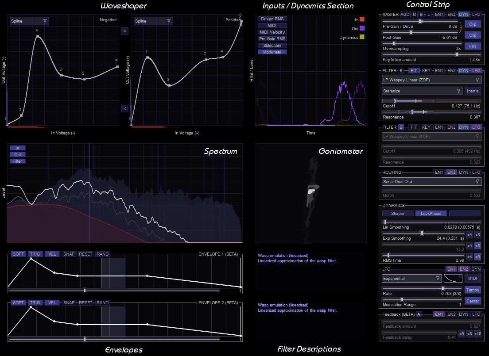

Filther is layed out in a few different sections. Try and locate the following sections in the image above: Waveshaper, Spectrum, Envelopes, Control Strip (with Master, Filter A, Filter B, Routing, Dynamics, LFO, Feedback, Inputs/Dynamics Section).

The manual is built up as follows. First, we go through the basics and guide you through the different elements that Filther has. Then we cover how to dynamically link the various elements to generate aggressive modulating sounds. This manual is best read twice, as some concepts mentioned briefly in earlier sections return in more detail later.

## UI Controls
#### Sliders
The backbone of Filther is a whole bunch of sliders. They look simple at first, but they have a hidden dark side to them. All of these sliders can be automated and linked up with various modulators in Filther.

The basic controls are mostly what you'd expect. Sliders can be dragged with the **left mouse button** or adjusted via the **scrollwheel**. More precise motions can be made by holding **CTRL**, **SHIFT** or both. **Double click** resets a slider. 

Modulations are essential to making interesting moving sounds with Filther and for this reason, most sliders allow a modulation range to be set. These modulation ranges can be set using the outer mouse button.

When activated, all applied modulators use the same set range. This is best explained with a short example. For instance, when two envelopes (E1 and E2) are active for one parameter, the resulting modulation range is given by ModRange * (E1+E2)/2.

The only exception to this rule is the LFO, which functions according to the LFO range, which is proportional to the modulation range, but which is added on top of the other modulators rather than averaged with them. In particular this last rule takes some getting used to.

#### Dropdown menu

A dropdown menu can be navigated by clicking them with the **left mouse button**, followed by the selection of an option. After a dropdown is selected, one can leaf through the different options using the **up** and **down arrow keys**. Alternatively, one can navigate the options by using the mousewheel. Note that some options listed may be more experimental than others (more dangerous). These options are listed in red and will be skipped when navigating with **arrow keys** or **mouse wheel**. It is also possible to blacklist other filters, by clicking them with the **right mouse button**. The blacklisted list will be stored in saved presets.

## Master Panel
Global properties can be found and controlled form the _Master Panel_ located on the _Control Strip_. 

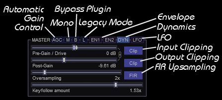

Here we find the following global controls:
- AGC: Automatic Gain Control, which tries to maintain a somewhat steady volume and protects your ears when you're experimenting with the more dangerous filters.
- M: Force Mono, which forces the output to be mono, to ensure that any stereo effects applied do not jeopardize your mono mix.
- B: Bypass, which bypasses the complete plugin.
- L: Legacy, which changes the scaling on the cutoff slider (this is best left disabled).
- En1: Enable settings modulation by Envelope 1.
- En2: Enable settings modulation by Envelope 2.
- Dyn: Modulate settings by Dynamics.
- LFO: Modulate settings by LFO.

Since Filther is a non-linear plugin, it responds differently to different levels of gain. While most of the non-linear filter models smoothly saturate, the waveshaper can respond dramatically different depending on how much input gain is provided.

## Waveshaper
Filther began its life as a waveshaper. This is also the reason that the waveshaper is so prominently placed in the UI. Filther supports saturating soft clipping as well as drawing custom voltage curves using a spline. These options can be selected from the Waveshaper Selection dropdown menu. For the simpler filters, the distortion is simply applied before the filtering stage, but for some the filter is located in the filter itself. In these cases, the distortion is either applied on the delayed or during solving the implicit equations for the supplied zero delay feedback filters (ZDF).

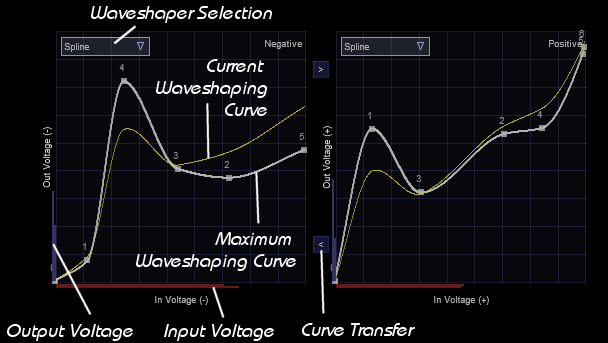

When looking at the waveshaping module in Filther, we notice two windows. One termed negative, the other called positive. These refer to the negative and positive parts of the audio waveform. Positive values are shaped according to the curve in the positive window, while negative parts are shaped according to the negative window.

The drawn waveshaping curve maps an input voltage to an output voltage. For each polarity, the current peak _Input Voltage_ is shown in red, below each graph. This peak value can be used to tune the input gain of the plugin, to make full use of the waveshaping functions. The _Output Voltage_ can be seen on the vertical axes and is drawn in blue.

When set to spline mode, user defined distortion curves can be drawn by moving control nodes around. New nodes can be created by pressing the __right mouse button__ anywhere inside the waveshaping window. They can also be deleted by clicking them with the __right mouse button__. A curve can be transferred from the positive voltage map to the negative voltage map using the _Curve Transfer_ buttons indicated in the figure.

_Hint: Waveshaping introduces higher harmonics and can cause aliasing. Aliasing refers to frequencies above Nyquist that wrap back into the spectrum and result in peaks that are inharmonic with respect to the source material. To mitigate this, Filther allows oversampling (see also: Oversampling)._ 

## Spectrum
Filter continuously shows you the input (shaded) and output (line) frequency spectrum as well as the filter characteristics (where sensible).

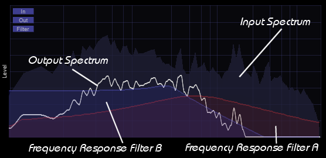

## Filters
Filther contains _two filter modules_ which can be fully automated by dynamics and LFO. Each filter can be bypassed by clicking the Bypass button. Again, we see in the group header that various modulations can be enabled or disabled. In both Filter sections modulation by a specific modulator can be toggled using the __left mouse button__. More fine grained control can be achieved using the __right mouse button__, which allows you to select either cutoff or resonance to be modulated by that specific modulator.

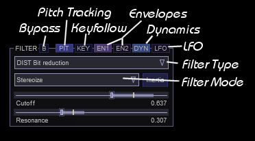

As shown in the image, the available modulators are:
- Pit: Follow pitch of incoming audio.
- Key: Follow last note of incoming MIDI.
- En1: Modulate setting(s) by Envelope 1.
- En2: Modulate setting(s) by Envelope 2.
- Dyn: Modulate setting(s) by Dynamics.
- LFO: Modulate setting(s) by LFO.

Filters can be chosen from the dropdown menu denoted by _Filter Type_ in the figure. Filther contains a large variety of filters to choose from, each with their own advantages and drawbacks. Most of the filters behave non-ideal and are intended for creative purposes rather than linearity.

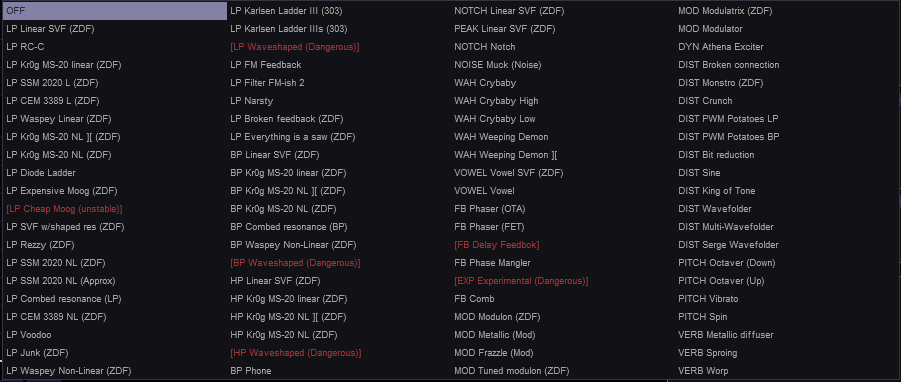

_Note: Not all filters are stable for all combinations of resonance and waveshaping. Using very sharp transitions in the spline waveshaper can result in filter instability for the filters where waveshaping is part of the filter. Filters which are more dangerous than others are marked in red._

### Special filter modes
Filter A has some special filter modes which can be used for stereo widening or processing samples differently. These can be selected from the _Filter Mode_ dropdown. Note that some of these modes are highly experimental and may misbehave (the ones that have the potential to misbehave are colored in red).

- Stereo - Default mode. Process left and right independently.
- Mono double - Interleave samples and process (Warning: this is not stable for all filter types).
- M1/S2 - Process mid regularly, feed side samples to filter twice (Warning: this is not stable for all filter types).
- M2/S1 - Feed mid to filter twice, process side regularly (Warning: this is not stable for all filter types).
- Only side - Only filter the side channel.
- Only mid - Only filter the mid channel.
- Stereo Boost - Filter both, but pre-amplify side channel.
- Stereoize - M/S processing. Side is boosted and computed with a delayed right channel for extra width.
- Subtle Stereo - M/S processing. Side is computed with a slightly delayed right channel for extra width.
- Inverted - Signal is run through the filter, but filtered signal is subtracted from original and then distorted.

### Key tracking
Keytracking can be used to track the frequency of incoming MIDI notes. This helps preserve timbre when notes of varying frequency are coming in. This is particularly important for ring modulation filters, which will otherwise sound terrible.

Key tracking can be enabled by enabling the KEY symbol above each filter. Note that you may have to adjust the cutoff accordingly after enabling keytracking. For normal frequency following, keep keytracking scaling in the _Master_ panel set to one.

_Note: When setting a filter up for keytracking, it can help to just loop a single MIDI note, so you can hone in on the cutoff better._

### Pitch follow
Pitch following is similar to keytracking in the sense that it attempts to follow the pitch of incoming notes. In contrast to keytracking, pitch following works on audio data rather than MIDI data. Enabling pitch following for any of the filters results in a detected pitch being displayed in the spectrum.

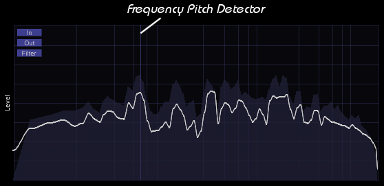

### Modulation filters
Modulation filters are special in the sense that they require accurate tuning to sound good. To help tune modulation filters, a few helper lines are drawn on the spectrum. For best results, try and match up the harmonics of the modulator with the harmonics of the input sound while having keytracking enabled.

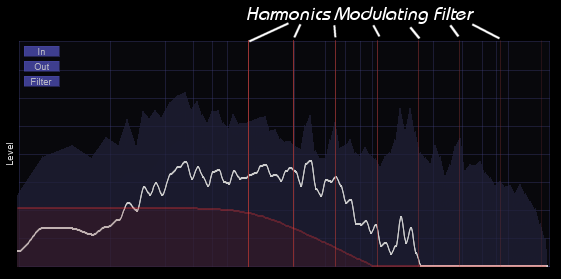

### Routing

Filther supports six routing modes which can be chosen in the routing submenu in the _control strip_.

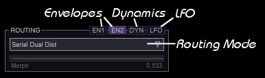

The different routing modes available are:
- Serial Dual Dist - Both filters are in series. Both with waveshaper enabled.
- Serial - Both filters are placed in series. The second filter does not use the waveshaper.
- Parallel Dual Dist - Both filters are in series. Both filters have the waveshaper enabled.
- Parallel - Both filters are in series. The second filter does not use the waveshaper.
- Morph Dual Dist - Both filters are linked in parallel. The Morph slider can be used to interpolate between A and B.
- Morph Dist - Both filters are linked in parallel. The Morph slider can be used to interpolate between A and B. B does not use the waveshaper.

_Note: The morph mode allows you to modulate the interpolation between Filter A and Filter B_

_Note: Using morph routing means you can only use a maximum of 7 nodes for the spline waveshaper._

## Dynamics
This is where the fun begins, but arguably also the most tricky part of controlling Filther and making it do what you want. Filther supports modulation of various settings via audio, MIDI or modulation wheel and it is exactly these modulations that can be used to make sounds move. 

Dynamics can be monitored in the dynamics window (shown on the left). Here you will typically see the input RMS (red curve), output RMS (purple curve) and most importantly, the dynamic variable (yellow curve). This dynamic variable and its position along the vertical axis determines the current modulation applied by any active **DYN** modulator. Zooming into the panel can be done by means of clicking with the **left mouse button** and **dragging**. 

Enabling the button *SHAPER* in the _dynamics_ section to enable modulation of the waveshaper by the dynamic variable. When enabled, Filther will interpolate between the non-waveshaped and waveshaped voltage input/output characteristic (1 being the fully waveshaped version). 

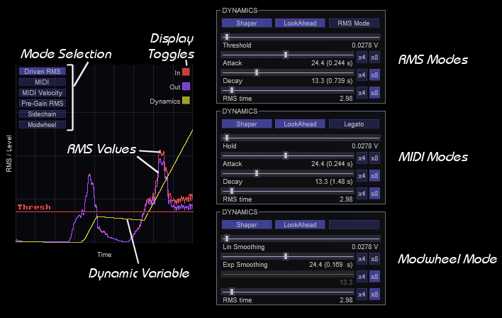

 Depending on which mode you are currently using, the vertical position of the dynamic variable is determined by different factors. Additionally, you will also be presented with different _Dynamics_ panels depending on the mode you are in. Let's go over the different modes:

#### Audio modes
These modes are driven by audio signals coming into Filther. They are *Driven RMS* which means Filther is listening to the RMS after the Pre-Gain stage. *Pre-Gain RMS*, which means it is listening to the incoming signal on channel 1 and 2 and *Sidechain*, which results in listening to channel 3 and 4. Note that when using the side chain mode, the displayed _in_ signal also shows that of the side chain. The audio modes come in two flavors: 

- Indirect mode: The dynamic variable (yellow curve) will start accumulating when the input RMS is above the threshold shown in the dynamics panel. This threshold can be dragged with the **left mouse button** or set in the dynamics panel. Additionally, the attack and decay of the dynamic variable can also be set here. Averaging can be increased by modifying the RMS time. This will smoothen out the RMS values that you see (and the dynamics will respond accordingly).
 
 - RMS mode: You can enable this mode by enabling "RMS Mode" under the dynamics panel. In this mode, the dynamic variable will be directly proportional to the incoming input signal. Curve/Attack gives the option of introducing some non-linearity to this relation, while inversion allows you to invert the relation (high RMS giving low dynamic variable). Note that setting inversion to 0.5 effectively disables the dynamic variable.

#### MIDI modes
In these modes, the dynamic curve is driven by MIDI input signals. Whereas *MIDI* only uses the note on and off information *MIDI Velocity* also makes use of the velocity information when determining the maximum amplitude of the dynamic variables.

- Non-Legato: In this mode, we have the option to specify a hold attack and decay time in the dynamics panel. Also note that when the next MIDI note starts, the envelope resets.

- Legato: In this mode, MIDI notes can be played legato. Leading to the envelope not resetting when going to the next note.

#### Modwheel mode
In this mode the dynamic variable is directly controlled via the modulation wheel. Since modulation wheel data is rather coarse, smoothing options become available once this mode is selected. One is linear, the other is exponential.

_Note: All of the sliders involving time have multipliers, which can be set for longer attack, hold and decay times._

## LFO
Filter sports a Low Frequency Oscillator (LFO) for modulating other parameters. Most LFO variables are self explanatory. When enabled, the *MIDI* button makes sure that any incoming MIDI note triggers a reset of the LFO. *Tempo* changes the time axis to a tempo synchronized axis and *Center* centers the LFO around the slider value, rather than setting its maximal extent to the slider value (without it, it moves in the direction of the modulation range).

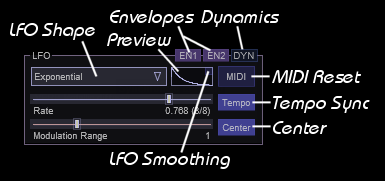

Whereas all other dynamic modulators in Filther (envelopes and dynamics) are averaged to work out to one dynamic modulation, the LFO is treated separately. The modulation strength of the LFO is set in the LFO panel with the parameter *Modulation Range*. While it will still be proportional to the range set on the modulation target, there is an extra level of control with respect to how much modulation is happening at any given time.

One last feature which may be important for some filter/LFO combo's is LFO smoothing. When enabled, sharp transients generated when the LFO resets or suddenly changes shape are smoothed out to avoid annoying artefacts. In can be enabled by clicking the little box inside the LFO preview.

## Envelopes
Envelopes can be used to add some extra dynamics to your sounds. They can be used as modulation sources alongside other sources. When _TRIG_ is enabled, an envelope will restart playback whenever a MIDI note is pressed. Once it gets to the _hold loop_ it will loop until the MIDI note is released. Note that when _TRIG_ is not active, the envelope will loop indefinitely and can be used as an alternative, more customizable LFO.

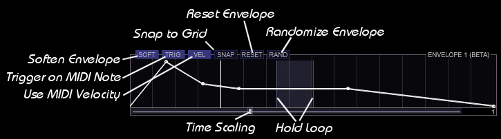

To add nodes to the envelope click the curve with the **right mouse button**. To remove nodes, click them with the **right mouse button**. Nodes can be dragged with the **left mouse button**. The **scrollwheel** can be used to zoom into the envelope, while **dragging** results in panning over the envelope. The duration of the envelope can be set by **dragging** the bottom slider.

## Feedback section
There is an additional feedback section, which can be activated.  Feedback can be used to fatten up filters and in some cases regain control of the resonance. If you want some fatness/resonance fighting, _keep the delay firmly placed at zero_. The feedback delay chain has the exact opposite polarity of the resonance in most chains, so in this mode, it will fight with the resonance to sort of choke in on itself. This can make the resonance less ringey, more chunky and a lot more pleasant to listen to. For a good example of this effect, set up a diode ladder or ms-20 with a lot of resonance. Then dial in the feedback with a feedback time of zero. You'll notice that the screechyness of the resonance goes down, giving way to a more chunky growliness.

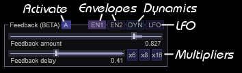

For phasey effects, use feedback with larger delays. Note however that then you're in the danger zone, because once resonance starts boosting resonance, things get real dicey. I would always recommend playing with this only if you have Automatic Gain Control (AGC) on.

_Note: Also note that using feedback, reduces the maximum number of spline nodes by two._

## Automatic Gain Control
When tweaking, enable Automatic Gain Control to protect your ears from resonance issues. This rescales the volume so that the RMS value post filter is the same as the input level (meaning that you can leave the post fader at 0 dB). You can transfer the estimated gain to the post-gain fader with the outer mouse once you've honed in on a preset you like.

## Oversampling
Filther supports oversampling. Oversampling can be useful when an effect introduces many harmonics due to non-linear distortion. These harmonics then result in aliasing, which is the result of frequencies folding back into the spectrum. Typically, most people do not like the sort of aliasing, as the newly introduced frequencies tend to be inharmonic with the ones already present.

Oversampling runs the waveshaper and simulates the filters at a higher samplerate. Subsequently aliasing is reduced by lowpassing the result before sampling down back to the normal sample rate.

Note that oversampling incurs significantly more CPU and that not all sounds need an oversampling solution. In particular sounds which are mostly concentrated in the low end, with very little presence in the higher frequencies may not need oversampling at all.

_Note: Some of the filters in filther require a minimal amount of oversampling for stability. These filters will always force the oversampling to be where they need it to be._

_Note: Both FIR and IIR upsampling/downsampling are provided. Whereas FIR filtering causes less phase distortion, it is more costly._

## Additional notes
- _When tweaking, enable Automatic Gain Control to protect your ears from resonance issues. This rescales the volume so that the RMS value post filter is the same as the input level (meaning that you can leave the post fader at 0 dB). You can transfer the estimated gain to the post-gain fader with the outer mouse_.
- Play with the Pre-Gain / Drive. It can make a huge difference for both the filters and the waveshaper.
- Some filters such as the MS-20 (my fav), Rezzy and CEM/SSM saturate quite nicely when driven. These can be used without wave-shaper to get a cleaner distortion.
- Not all filters are unconditionally stable, so that means that some can bite your head of and end in a sad click. Most are though. 
- Some originate from music fora (Diode ladder, Karlsen ladder), others I implemented from papers (Expensive Moog, the phasers), others I modeled after circuit boards or diagrams found online (Kr0g, SSM, CEM) and some I circuit bended into existence (Experimental, Rezzy, Phase Mangler).
- The filters, all IIRs are not meant to be clean, many of them saturate in non-linear ways and add a lot of color to your sounds.
- The routing on each filter is different. For some the waveshaper is inside the filter feedback, for others it is a pre or post processing step. Deciding where to put the waveshaper was done subjectively.
- The nonlinear filters are more expensive since they solve a nonlinear system of equations at every sample. For all of the nonlinear filters I have also implemented a linearized variant and if you don't use the filter in its saturation range, it is better to use the linear variants for performance reasons.
- ZDF in the filter name stands for Zero Delay Feedback, which means that there is no extra delay present in the feedback loop.
- Spline waveshaping is significantly more expensive than atanh or fast waveshaping. It can also cause instability in some filters where the spline is in the feedback loop. Yet, because a lot of sonic sweetspots exist that make use of this, I have decided to still expose the ability to do this. Tread lightly.
- Have fun with dynamics. Motion makes everything better.
- Feedback can be used to fatten up filters and in some cases regain control of the resonance. If you want some fatness/resonance fighting, _keep the delay firmly placed at zero_. The feedback delay chain has the exact opposite polarity of the resonance in most chains, so in this mode, it will fight with the resonance to sort of choke in on itself (see diode ladder or ms-20 for this effect). This can make the resonance less ringey, more chunky and a lot more pleasant to listen to. Note that the global feedback is not ZDF. Also note that using feedback, reduces the maximum number of spline nodes by two.
- For phasey effects, use feedback with larger delays. Note however that then you're in the danger zone, because once resonance starts boosting resonance, things get real dicey. I would always recommend playing with this only if you have AGC on.
- Morph mode (under routing) allows you to interpolate between filter A and B. Note however, that morph mode eats one node of the spline.